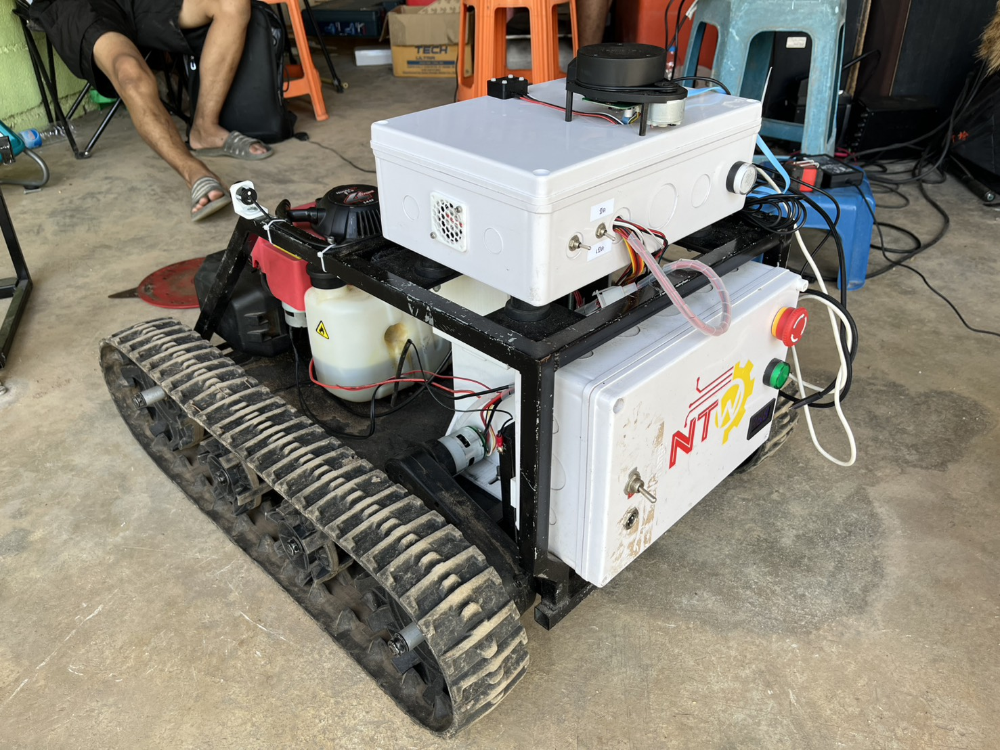
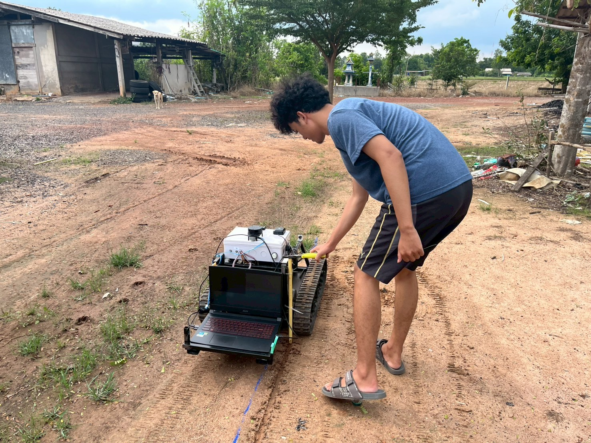
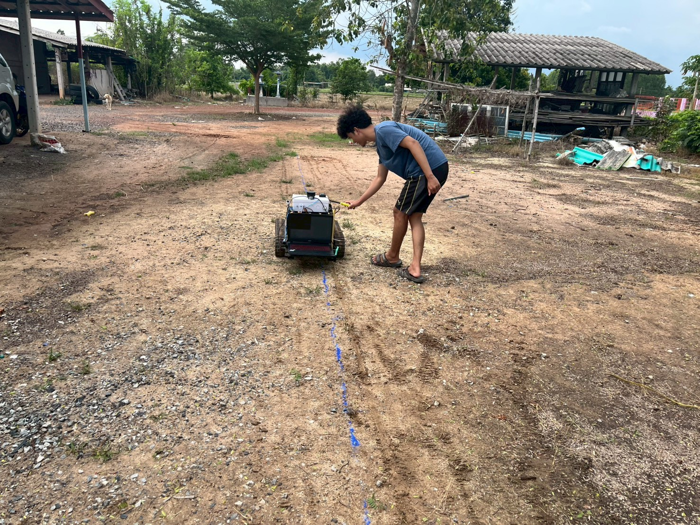
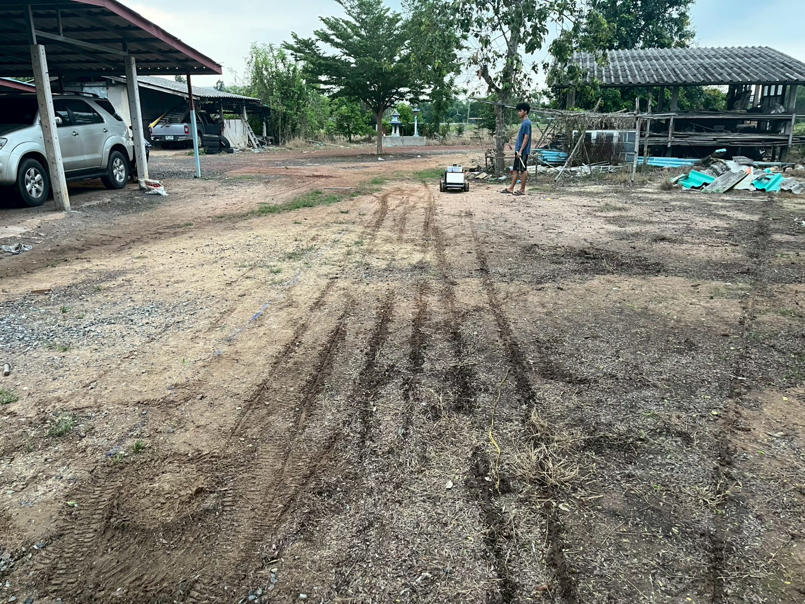
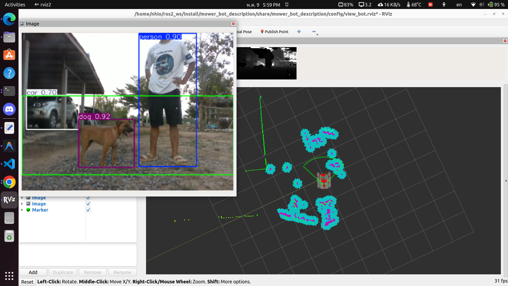
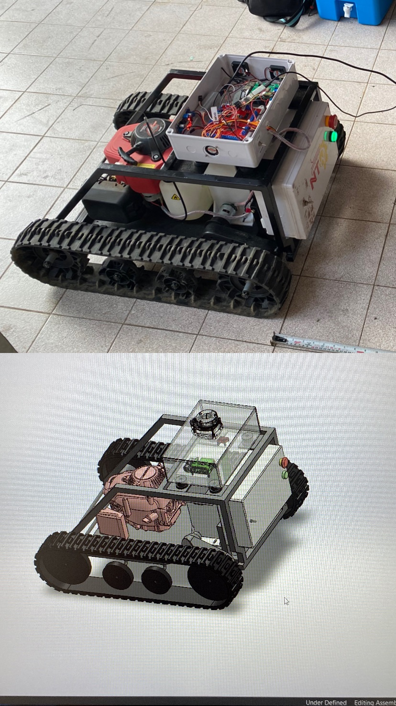
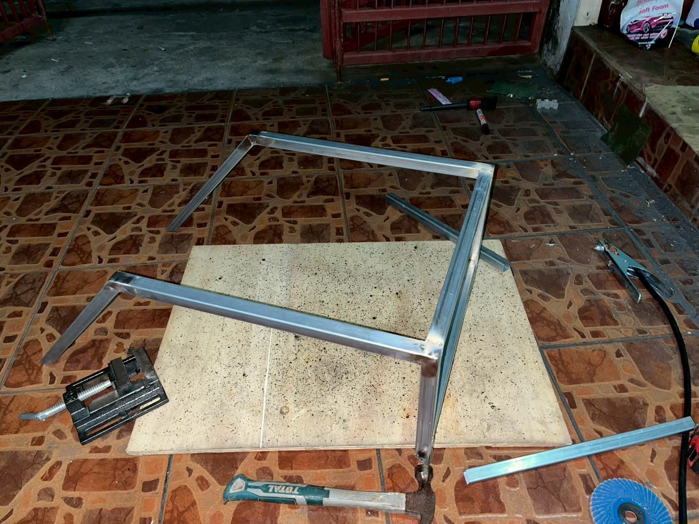
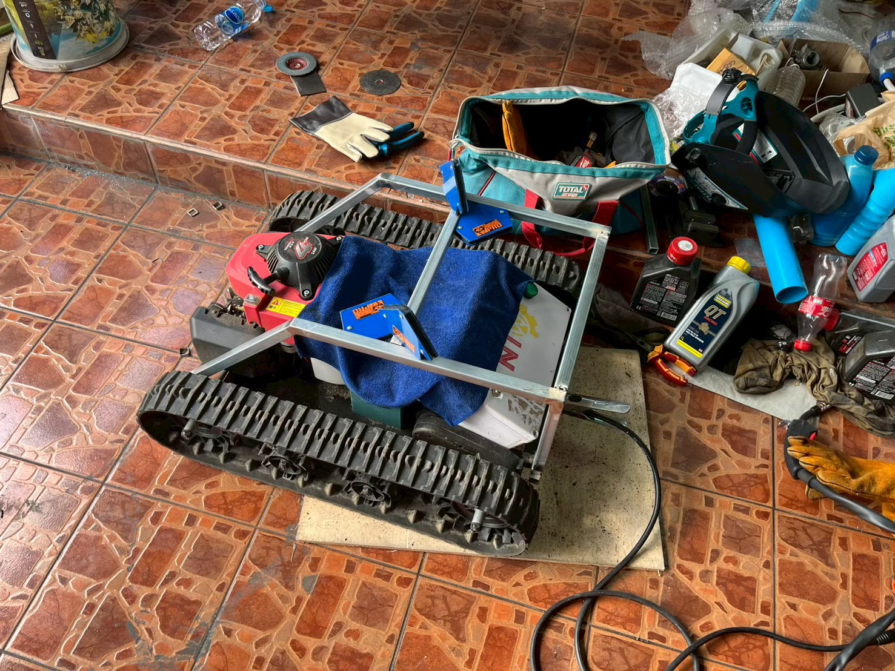
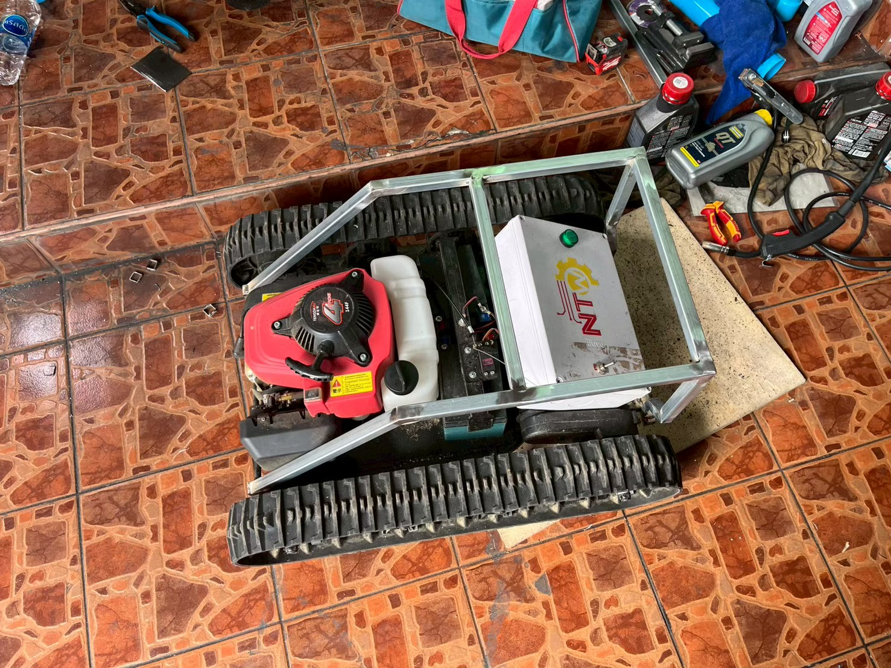

# 🚜 Autonomous Lawn Mower Robot — ROS 2 & STM32

<div align="center">


**โปรเจคจบการศึกษา (Senior Project) ปีการศึกษา 2567**<br>
ระบบรถตัดหญ้าอัตโนมัติควบคุมด้วย ROS 2 — แม่นยำระดับเซนติเมตร ปลอดภัยด้วย AI

<br>



</div>

---

## 📖 ภาพรวมโปรเจค

ระบบรถตัดหญ้าอัตโนมัติ (Autonomous Lawn Mower) แบบ **Differential Drive** พัฒนาด้วย **ROS 2 Humble** บน **Raspberry Pi 5** ควบคุมฮาร์ดแวร์ผ่าน **STM32F103C8T6** โดยผสาน Sensor หลายตัว (RTK GPS, LiDAR, IMU, Encoder, Ultrasonic) ด้วยเทคนิค **Extended Kalman Filter (EKF)** เพื่อการ Localization ที่แม่นยำ พร้อมระบบ **Geofencing**, **YOLO Vision**, และ **Nav2 Navigation Stack**

---

## 🎬 Demo

### ทดสอบในสนามจริง

<div align="center">

| ตั้งค่าและเตรียมระบบ | วิ่งทดสอบอัตโนมัติ |
|:---:|:---:|
|  |  |


*รถวิ่งอัตโนมัติครอบคลุมพื้นที่ด้วย Coverage Path Planning*

</div>

### ระบบ AI Vision + LiDAR Mapping (RViz2)

<div align="center">


*YOLO ตรวจจับคนและสัตว์ (ซ้าย) + LiDAR Point Cloud Map (ขวา) แบบ Real-time*

</div>

### วิดีโอสาธิต

> 📹 ดูวิดีโอทดสอบในสนามจริงได้ที่: [`Video/demo_field_test.mp4`](Video/demo_field_test.mp4)

---

## ✨ ฟีเจอร์หลัก

| ฟีเจอร์ | รายละเอียด |
|---------|-----------|
| 📡 **RTK GPS + EKF Fusion** | Localization แม่นยำระดับเซนติเมตร โดยรวม GPS และ Wheel Odometry ด้วย Extended Kalman Filter |
| 🗺️ **SLAM & Nav2** | สร้างแผนที่อัตโนมัติ และวางแผนเส้นทางตัดหญ้าแบบ Zig-Zag Coverage Path |
| 🛡️ **Geofencing** | กำหนดขอบเขตการทำงานด้วย GPS Waypoints ป้องกันรถออกนอกพื้นที่ |
| 👁️ **YOLO Vision** | ตรวจจับสิ่งกีดขวางด้วย YOLOv11 + Intel RealSense Depth Camera |
| 🔊 **Ultrasonic Safety** | ตรวจจับสิ่งกีดขวางระยะใกล้รอบทิศทาง |
| 💓 **Heartbeat Safety** | ระบบตรวจสอบการเชื่อมต่อ — หยุดรถทันทีเมื่อขาดการเชื่อมต่อ |
| 🔧 **Engine Control** | สตาร์ท/ดับเครื่องยนต์และควบคุม Throttle ผ่าน Software |
| 🎮 **Gazebo Simulation** | จำลองระบบก่อน Deploy จริง รองรับ Nav2 + EKF ใน Simulation |
| 📊 **Real-time Dashboard** | แสดงสถานะระบบแบบ Real-time ผ่าน Terminal |

---

## 🔩 ฮาร์ดแวร์ (Hardware)

<div align="center">


*CAD Design (ล่าง) เปรียบเทียบกับหุ่นยนต์ที่สร้างจริง (บน)*

</div>

| ชิ้นส่วน | รุ่น/ประเภท | หน้าที่ |
|---------|-----------|--------|
| Main Computer | **Raspberry Pi 5** | รัน ROS 2, Navigation, AI |
| Microcontroller | **STM32F103C8T6** (Bluepill) | ควบคุมมอเตอร์, อ่าน Encoder/IMU |
| GPS | **RTK GPS** (NTRIP via KMUTNB65) | Localization แม่นยำ |
| LiDAR | **RPLiDAR** | SLAM และตรวจจับสิ่งกีดขวาง |
| Camera | **Intel RealSense D4xx** | YOLO Object Detection + Depth |
| IMU | **MPU6050 / BNO055** | วัดมุมเอียงและ Angular Velocity |
| Ultrasonic | **HC-SR04** (ผ่าน Arduino) | ตรวจจับสิ่งกีดขวางระยะใกล้ |
| Encoder | **Hall Effect Encoder** | วัด Wheel Odometry |
| Drive System | **Rubber Track (สายพาน)** | เคลื่อนที่บนพื้นที่ขรุขระ |
| Engine | **Honda GX Series** | ใบมีดตัดหญ้า |

---

## 🛠️ กระบวนการสร้าง (Build Process)

<div align="center">

| ขั้นที่ 1: ตัดและเชื่อมโครงอลูมิเนียม | ขั้นที่ 2: ประกอบระบบสายพานและมอเตอร์ |
|:---:|:---:|
|  |  |

| ขั้นที่ 3: ติดตั้งเครื่องยนต์และระบบตัดหญ้า | ขั้นที่ 4: ติดตั้ง Electronics และ Sensors |
|:---:|:---:|
|  |  |

</div>

---

## 🏗️ สถาปัตยกรรมระบบ

```
┌─────────────────────────────────────────────────────────┐
│                   Raspberry Pi 5 (ROS 2)                │
│                                                         │
│  ┌──────────┐  ┌───────────┐  ┌──────────────────────┐ │
│  │  Nav2    │  │   EKF     │  │   Geofence & Planner │ │
│  │ Stack    │──│Localization│  │   (Safety Layer)     │ │
│  └──────────┘  └─────┬─────┘  └──────────────────────┘ │
│       │              │                                  │
│  ┌────▼─────────────▼──────────────────────────────┐   │
│  │              ROS 2 Topic Bus                     │   │
│  └────┬──────────┬──────────┬──────────┬───────────┘   │
│       │          │          │          │                │
│  ┌────▼───┐ ┌────▼───┐ ┌───▼────┐ ┌───▼────┐          │
│  │RPLiDAR │ │RTK GPS │ │ Camera │ │Ultrason│          │
│  │ Node   │ │(NTRIP) │ │(YOLO)  │ │ Node   │          │
│  └────────┘ └────────┘ └────────┘ └────────┘          │
└──────────────────────────┬──────────────────────────────┘
                           │ Serial (UART)
┌──────────────────────────▼──────────────────────────────┐
│                  STM32F103C8T6                           │
│   Motor Driver │ Encoder Reading │ IMU │ Engine Control  │
└─────────────────────────────────────────────────────────┘
```

---

## 📂 โครงสร้างโปรเจค

```
ros2_final_project_ws/
├── src/
│   ├── robot_bridge/            # 🧠 ROS2 Package หลัก
│   │   ├── robot_bridge/        # Python nodes
│   │   │   ├── arduino_reader.py        # รับข้อมูล Ultrasonic จาก Arduino
│   │   │   ├── auto_datum_node.py       # ตั้งจุด Datum GPS อัตโนมัติ
│   │   │   ├── geofence_and_planner.py  # Geofence + Coverage Path Planning
│   │   │   ├── geofence_enforcer.py     # Safety: บังคับขอบเขต GPS
│   │   │   ├── lawn_planner.py          # สร้างเส้นทาง Zig-Zag
│   │   │   ├── mow_zigzag.py            # Executor: สั่งวิ่งตามเส้นทาง
│   │   │   ├── ntrip_client.py          # RTK GPS via NTRIP
│   │   │   ├── robot_dashboard.py       # Real-time Status Dashboard
│   │   │   ├── teleop_stm.py            # Teleop → STM32 bridge
│   │   │   ├── ultrasonic_converter.py  # แปลง Ultrasonic → ROS2 topics
│   │   │   └── vision_node.py           # YOLOv11 + RealSense
│   │   ├── launch/
│   │   │   ├── hardware_bringup.launch.py   # เปิดระบบฮาร์ดแวร์ทั้งหมด
│   │   │   ├── localization.launch.py       # EKF Fusion
│   │   │   ├── navigation.launch.py         # Nav2 Stack
│   │   │   └── simulation.launch.py         # Gazebo Simulation
│   │   └── config/
│   │       ├── ekf.yaml             # EKF parameters
│   │       ├── nav2_params.yaml     # Nav2 configuration
│   │       └── twist_mux.yaml       # Velocity command priority
│   │
│   ├── mower_bot_description/   # 🤖 Robot URDF & Simulation
│   └── rplidar_ros/             # 📡 RPLiDAR Driver
│
├── config/                      # ⚙️ Runtime configs
│   ├── lawn_geofence.yaml       # Geofence waypoints (real)
│   ├── lawn_geofence_sim.yaml   # Geofence waypoints (sim)
│   └── udev/                    # USB device rules
│
├── images/                      # 🖼️ Project images (GitHub)
├── Video/                       # 🎬 Demo video
├── scripts/                     # 🔧 Utility & calibration scripts
├── firmware/                    # 💾 ESP32 / Arduino firmware
├── Arduino_Ultrasonic/          # 🔊 Arduino ultrasonic firmware
├── extracted_project/           # 📦 STM32 PlatformIO firmware
├── docs/                        # 📚 Documentation
│
├── start_robot.sh               # 🚀 เปิดระบบหุ่นยนต์จริง (1 คำสั่ง)
├── start_sim.sh                 # 🎮 เปิด Simulation
├── setup_ws.sh                  # ⚡ Source workspace
└── COMMANDS.md                  # 📋 Command cheatsheet
```

---

## 🚀 วิธีติดตั้งและใช้งาน

### ความต้องการของระบบ (Prerequisites)

- **OS:** Ubuntu 22.04 (Jammy)
- **ROS 2:** Humble Hawksbill
- **Python:** 3.10+
- **Hardware:** Raspberry Pi 5 (แนะนำ RAM ≥ 8GB)

### 1. ติดตั้ง ROS 2 Humble

```bash
chmod +x install_ros2_humble.sh install_dependencies.sh
./install_ros2_humble.sh
./install_dependencies.sh
```

### 2. Clone และ Build

```bash
git clone https://github.com/<your-username>/ros2_final_project_ws.git
cd ros2_final_project_ws

pip3 install -r requirements.txt

source /opt/ros/humble/setup.bash
colcon build --symlink-install

source setup_ws.sh
```

### 3. ติดตั้ง udev rules (ทำครั้งเดียว)

```bash
sudo cp config/udev/98-gps.rules   /etc/udev/rules.d/
sudo cp config/udev/99-stm32.rules /etc/udev/rules.d/
sudo udevadm control --reload-rules && sudo udevadm trigger
```

---

## ▶️ การใช้งาน

### 🤖 เปิดระบบหุ่นยนต์จริง

```bash
cd ~/ros2_final_project_ws
./start_robot.sh
```

สคริปต์จะเปิด Terminal tabs อัตโนมัติ:

| แท็บ | ระบบ |
|-----|------|
| 1. HARDWARE | RPLiDAR, STM32, GPS, Camera |
| 2. LOCALIZATION | EKF Sensor Fusion |
| 3. NAVIGATION | Nav2 Path Planning |
| 4. SAFETY & PLANNER | Geofence + Coverage Path |
| 6. MOWING | Mow Executor (พิมพ์ `go` เพื่อเริ่ม) |
| 7. DASHBOARD | Real-time Status |

### 🎮 เปิด Simulation (Gazebo)

```bash
cd ~/ros2_final_project_ws
./start_sim.sh
```

### 🔧 Calibration

```bash
source setup_ws.sh
python3 scripts/calibrate_robot.py linear 1.0    # ระยะทาง
python3 scripts/calibrate_robot.py angular 90    # การหมุน
```

---

## 📡 ROS 2 Topics หลัก

| Topic | Type | รายละเอียด |
|-------|------|-----------|
| `/cmd_vel` | `geometry_msgs/Twist` | คำสั่งความเร็ว (Nav2 → STM32) |
| `/odom_raw` | `nav_msgs/Odometry` | Wheel Odometry จาก STM32 |
| `/odometry/filtered` | `nav_msgs/Odometry` | EKF fused odometry |
| `/fix` | `sensor_msgs/NavSatFix` | RTK GPS position |
| `/scan` | `sensor_msgs/LaserScan` | RPLiDAR data |
| `/ultrasonic/center` | `sensor_msgs/Range` | Ultrasonic distance |
| `/camera/yolo/debug_image` | `sensor_msgs/Image` | YOLO detection output |
| `/imu/data` | `sensor_msgs/Imu` | IMU data |

---

## 👥 ทีมผู้จัดทำ

| ชื่อ | รหัสนักศึกษา |
|-----|-------------|
| **นายพงศธร รอดพิพัฒน์** | 6703016410080 |
| **นายทินภัทร จิตต์บุญ** | 6703016410039 |
| **นายวัชรากร เพกรา** | 6703016410179 |

**อาจารย์ที่ปรึกษา:** ผศ.ดร.สุพจน์ แก้วกรณ์

**สังกัด:** ภาควิชาวิศวกรรมเมคคาทรอนิกส์ — มหาวิทยาลัยเทคโนโลยีพระจอมเกล้าพระนครเหนือ (KMUTNB)

---

## 📄 License

โปรเจคนี้จัดทำเพื่อการศึกษาเท่านั้น (Academic Use Only)

© 2026 Autonomous Mower Project — All Rights Reserved
